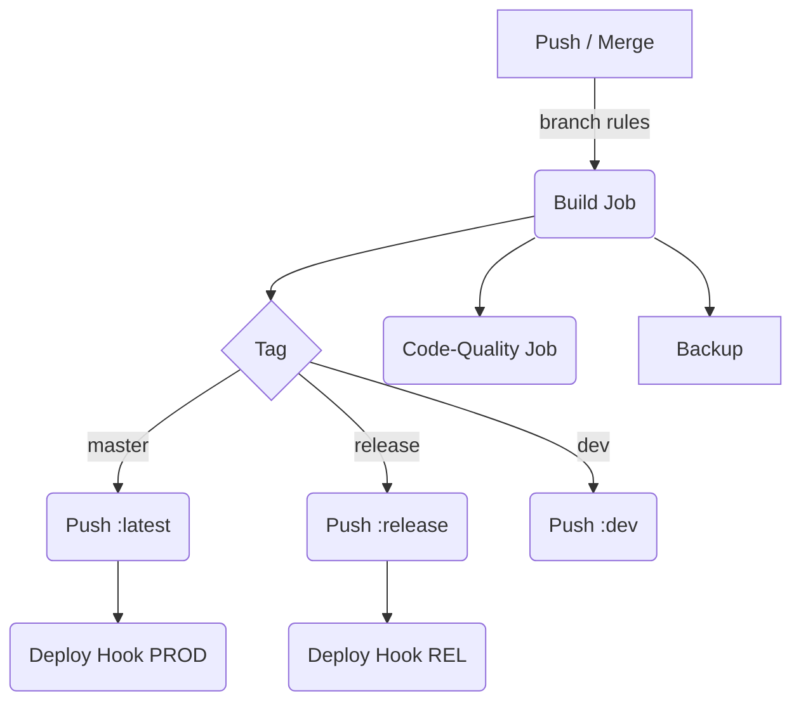

# SSO‑TAAG – Contenedor Laravel + Nginx + PHP‑FPM + Vite

> **Imagen base:** `registry.it.taag.network/txa-lab-solutions/sso-taag:build`

Este repositorio contiene la aplicación SSO‑TAAG lista para ejecutarse en **desarrollo**, **QA** o **producción** mediante Docker y GitLab CI/CD.

---

## Tabla de contenidos

1. [Requisitos](#requisitos)
2. [Estructura de carpetas](#estructura-de-carpetas)
3. [Flujos de ejecución](#flujos-de-ejecución)
   - [Desarrollo – override](#desarrollo)
   - [Producción / QA](#producción--qa)
4. [Comandos rápidos](#comandos-rápidos)
5. [CI/CD (GitLab)](#cicd-gitlab)
6. [Despliegue en Portainer](#despliegue-en-portainer)
7. [Mantenimiento y buenas prácticas](#mantenimiento-y-buenas-prácticas)

---

## Requisitos

| Herramienta                                                | Versión mínima |
| ---------------------------------------------------------- | -------------- |
| Docker Engine                                              | 24             |
| Docker Compose                                             | 2.20           |
| GitLab Runner                                              | 16             |
| Acceso al **registry privado**: `registry.it.taag.network` |                |

---

## Estructura de carpetas

```
.
├── .docker/                # Configuración de contenedor
│   ├── Dockerfile          # Imagen base (build)
│   ├── start.sh            # Arranque de servicios
│   └── background.sh       # Preparación del entorno
├── docker-compose.yml      # Stack base (prod)
├── docker-compose.override.yml  # Solo para desarrollo
├── .gitlab-ci.yml          # Pipeline CI/CD
└── src/…                   # Código Laravel + Vite
```

---

## Flujos de ejecución

### Desarrollo

```bash
# 1. Crear directorios de protección (una sola vez)
mkdir -p vendor node_modules

# 2. Levantar stack en modo dev
docker compose \
  -f docker-compose.yml \
  -f docker-compose.override.yml \
  up -d --build
```

- El volumen `.:/app` **sobrescribe** el código de la imagen.
- `background.sh` detecta `APP_ENV=local` y ejecuta:
  - `composer install`
  - `npm install`
  - `npm run build` (o `npm run dev` si lo ajustas)
- Hot‑reload disponible por el puerto **5173**.

### Producción / QA

```bash
# Build + run local (sin override)
docker compose -f docker-compose.yml up -d --build
```

| Acción                                | Lugar                           |
| ------------------------------------- | ------------------------------- |
| `composer install`                    | **Dockerfile** (etapa derivada) |
| `npm install` & `npm run build`       | **Dockerfile**                  |
| Servicios (nginx, php‑fpm, cron, ssh) | **start.sh**                    |

---

## Comandos rápidos

| Tarea                 | Comando                    |
| --------------------- | -------------------------- |
| Ver logs en vivo      | `docker logs -f sso`       |
| Entrar al contenedor  | `docker exec -it sso bash` |
| Artisan dentro        | `php artisan migrate`      |
| Vite dev (ya montado) | `npm run dev`              |

---

## CI/CD (GitLab)



### Highlights

- **backup\_job**: Hace tag `latest-back` antes de sobrescribir `latest`.
- **build\_job**: Etiqueta la imagen según la rama (`latest`, `release`, `dev`, `build`).
- **deploy**: Dispara webhook a Portainer según rama.
- **code\_quality\_job**: Ejecuta `phpcbf` usando imagen `qa`.

---

## Despliegue en Portainer

1. **Stack (opción recomendada)**
   ```yaml
   services:
     sso:
       image: registry.it.taag.network/txa-lab-solutions/sso-taag:latest
       env_file:
         - .env
       ports:
         - "80:80"
         - "443:443"
       networks:
         - net-sso
   networks:
     net-sso:
       driver: bridge
   ```
2. **Contenedor único**: selecciona la imagen y define `APP_ENV=production`.
3. **No montes volúmenes** sobre `/app`.

---

## Mantenimiento y buenas prácticas

- **Versiona** la imagen base (`sso-taag:build‑N`) para mantener reproducibilidad.
- Usa `.dockerignore` para excluir artefactos locales.
- Renueva certificados SSL si superan los **965 días**.
- Automatiza limpieza de logs con `logrotate` si crecen demasiado.
- Activa monitoreo de contenedor (CPU/RAM) en Portainer.

---

> **Contacto**: DevOps · *txa‑lab‑*[*solutions@taag.com*](mailto\:solutions@taag.com)

